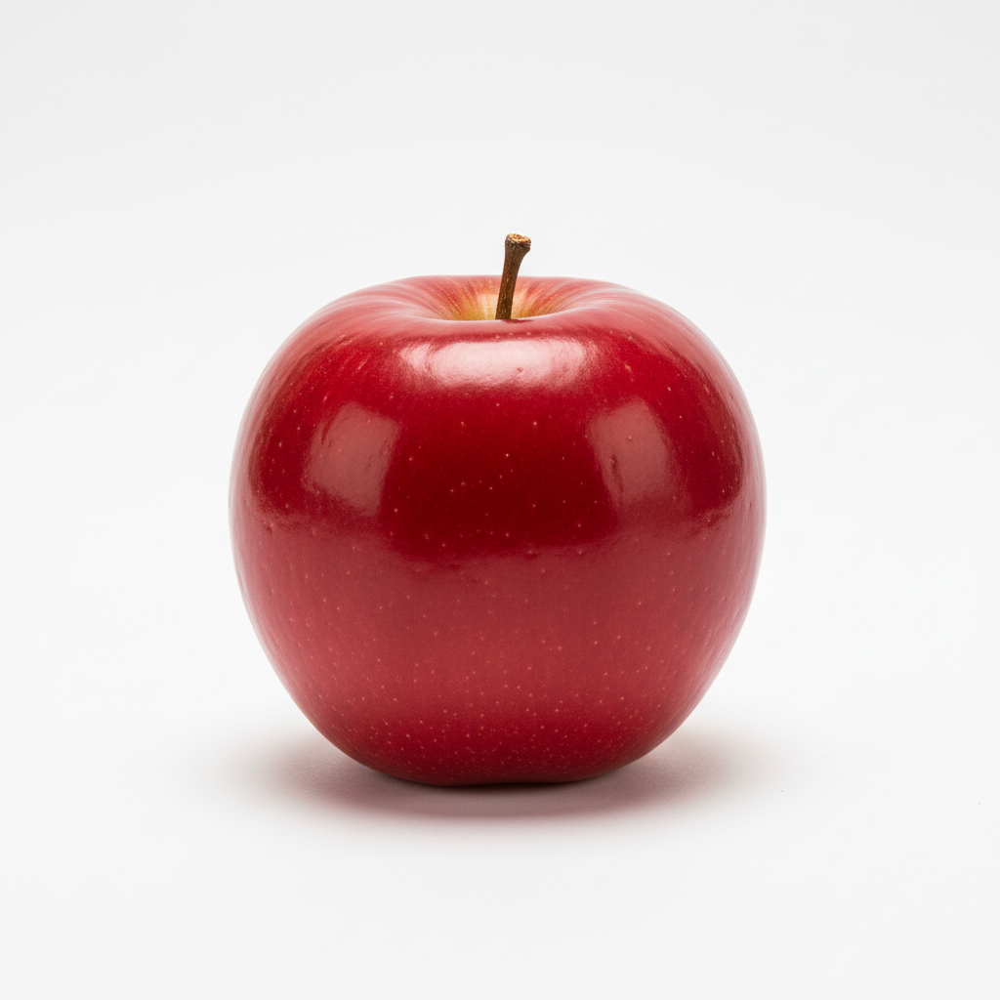
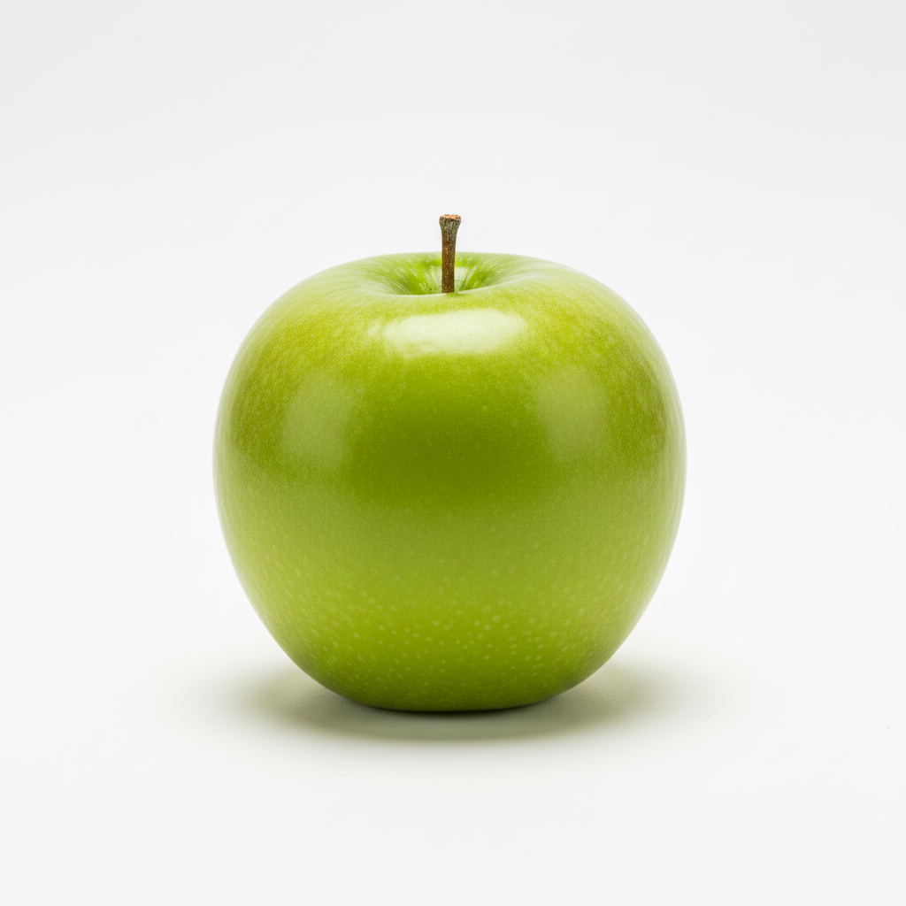

# SwiftMageX

[English](README.md) · [Español](README.es.md) · [Français](README.fr.md) · [Deutsch](README.de.md) · [简体中文](README.zh-CN.md) · [日本語](README.ja.md) · [한국어](README.ko.md) · [Português (BR)](README.pt-BR.md) · [Italiano](README.it.md) · [Русский](README.ru.md)

CLI de geração e processamento de imagens exclusivo para macOS.
SwiftMageX é um *orquestrador*: aciona a API de imagens do Google AI (Gemini ou Imagen) para geração e
executa operações raster locais (resize, sobreposição de texto,
composição, capturas para App Store, remoção de fundo, recorte
sensível à saliência) com CoreImage / CoreText / ImageIO / Vision —
tudo num pequeno pacote Swift com exatamente duas dependências externas. A mesma biblioteca central
sustenta um servidor Model Context Protocol (`swiftmagex-mcp`) para
que agentes de IA usem essas capacidades como ferramentas.

A especificação autoritativa está em `SwiftMageX-MVP-0.1-spec.md`; o
que foi entregue na v0.1.0 está em `RELEASE_NOTES.md`.

## Requisitos

- macOS 14+ em Apple silicon (arm64)
- Toolchain Swift 6.0+ (Xcode 16+) — necessária apenas para construir
  a partir do código-fonte
- Uma chave de API do Google AI em `SWIFTMAGEX_GEMINI_API_KEY` (ou
  `GEMINI_API_KEY`) para o comando `generate` — vale tanto para
  modelos Gemini quanto Imagen. `resize`, `text`, `composite`, `appstore`, `remove-bg` e `crop` não exigem chave.

## Instalação

### Binário pré-compilado (recomendado)

Baixe `swiftmagex`, `swiftmagex-mcp` e `SHA256SUMS` da
[release v0.1.0](https://github.com/khodulov-m/SwiftMageX/releases/tag/v0.1.0),
verifique as somas e coloque os binários no `PATH`:

```sh
shasum -a 256 -c SHA256SUMS
chmod +x swiftmagex swiftmagex-mcp
sudo mv swiftmagex swiftmagex-mcp /usr/local/bin/
swiftmagex --version    # 0.1.0
```

Se o Gatekeeper colocar os downloads em quarentena, remova o atributo:

```sh
xattr -d com.apple.quarantine /usr/local/bin/swiftmagex /usr/local/bin/swiftmagex-mcp
```

### Construir do código-fonte

```sh
git clone https://github.com/khodulov-m/SwiftMageX.git
cd SwiftMageX
swift build -c release
# os binários ficam em .build/arm64-apple-macosx/release/
cp .build/arm64-apple-macosx/release/swiftmagex     /usr/local/bin/
cp .build/arm64-apple-macosx/release/swiftmagex-mcp /usr/local/bin/
```

### Executar a partir do código-fonte sem instalar

```sh
swift run swiftmagex <subcomando> …      # CLI
swift run swiftmagex-mcp                 # servidor MCP (transporte stdio)
swift test                               # suíte de testes completa
scripts/check.sh                         # build + testes em um passo
```

### Configuração

Exporte a chave da API do Gemini no seu perfil de shell (necessária
apenas para `generate`):

```sh
export SWIFTMAGEX_GEMINI_API_KEY="…"   # preferida
# alternativamente, a ferramenta também lê:
export GEMINI_API_KEY="…"
```

Nunca embuta a chave em scripts versionados. A CLI nunca imprime,
loga ou grava a chave em disco — nem sob `--verbose`, nem nos
metadados do arquivo de saída.

## Manual rápido

Oito subcomandos, todos compartilhando as mesmas flags globais:

| Flag global | Efeito |
|---|---|
| `--json` | Emite um envelope JSON estruturado em stdout no lugar de texto humano. |
| `-v`, `--verbose` | Envia diagnósticos para stderr. **Não** inclui a chave de API. |
| `--version` | Imprime `0.1.0` e termina. |
| `-h`, `--help` | Mostra a ajuda do comando. |

Caminhos de saída são sempre **absolutos** na saída `--json` e nos
resultados das ferramentas MCP — o agente não precisa saber o
diretório de trabalho.

### `swiftmagex generate` — texto para imagem via Gemini ou Imagen

```
swiftmagex generate <prompt> [opções]
```

| Opção | Padrão | Notas |
|---|---|---|
| `<prompt>` | — | Argumento posicional obrigatório. |
| `-o`, `--output <caminho>` | `./` | Arquivo ou diretório. Como diretório, os nomes seguem `swiftmagex_{timestamp}_{index}.png`. |
| `-s`, `--size <square\|portrait\|landscape>` | `square` | Dica de proporção. A resolução real depende do modelo. |
| `-n`, `--count <1–4>` | `1` | Número de variantes. Cada variante é uma requisição separada. |
| `--seed <uint64>` | — | Registrado nos metadados mesmo quando o provedor o ignora. |
| `--model <id>` | `gemini-2.5-flash-image` | Embutidos: família Gemini (`gemini-2.5-flash-image`, `gemini-3-pro-image-preview`, `gemini-3.1-flash-image-preview`) e família Imagen (`imagen-4.0-generate-001`, `imagen-4.0-fast-generate-001`, `imagen-4.0-ultra-generate-001`). IDs desconhecidos são roteados pelo prefixo `imagen-`/`gemini-`. |

```sh
# Imagem única no diretório atual
swiftmagex generate "neon-lit cyberpunk alley in the rain"

# Quatro variantes paisagem em um diretório, saída estruturada
swiftmagex generate "mountain landscape at dawn" -n 4 -s landscape -o ./out --json

# Seed reprodutível (depende do provedor)
swiftmagex generate "minimalist app icon, fox head" --seed 42 -o icon.png
```

Exemplo — a chamada abaixo gerou a imagem a seguir (PNG 1024×1024 com
`gemini-2.5-flash-image`):

```sh
swiftmagex generate "A simple red apple on a white background, test image" \
  -o apple.png
```


Cada PNG de saída leva prompt, modelo, seed, timestamp e versão da
ferramenta em chunks `tEXt` (em JPEG, no campo EXIF `UserComment`).

### `swiftmagex edit` — imagem-para-imagem / inpainting via Gemini

Envia uma imagem de origem (e uma máscara opcional) para um modelo Gemini
junto com o prompt de texto. A imagem viaja como parte `inlineData` na
mesma chamada `:generateContent` que `generate` usa — sem novo endpoint,
sem nova dependência.

```
swiftmagex edit <input> <prompt> [opções]
```

| Opção | Padrão | Notas |
|---|---|---|
| `<input>` | — | Obrigatório. Imagem de origem (PNG ou JPEG). |
| `<prompt>` | — | Obrigatório. Instrução de texto descrevendo a edição. |
| `--mask <caminho>` | — | Máscara opcional em tons de cinza ou binária (PNG ou JPEG). Branco marca a região a editar; preto preserva o original. |
| `-o`, `--output <caminho>` | `./` | Arquivo ou diretório. Se diretório, os arquivos são nomeados `swiftmagex_{timestamp}_{index}.png`. |
| `-n`, `--count <1–4>` | `1` | Quantidade de variantes. Cada variante é uma requisição separada. |
| `--seed <uint64>` | — | Registrado em metadados mesmo quando o provedor o ignora. |
| `--model <id>` | `gemini-2.5-flash-image` | Deve ser um modelo Gemini — a forma `:predict` do Imagen não aceita entradas de imagem inline e é rejeitada com código de saída 2. |

```sh
# Mudar a cor de um sujeito
swiftmagex edit apple.png "make the apple green instead of red" -o edited.png

# Inpaint de uma região com máscara
swiftmagex edit photo.png "replace the marked region with a sunset sky" \
  --mask sky-mask.png -o photo_edited.png

# Quatro variantes da mesma edição
swiftmagex edit shot.jpg "add a snowy mountain in the background" -n 4 -o ./out
```

Exemplos — três pares antes / depois (origens e edições em
[`examples/`](examples)):

| Origem | Editada | Prompt de edição |
|---|---|---|
|  |  | `"Change the apple's color from red to bright green, keep everything else identical"` |
|  |  | `"Add a single colorful hot-air balloon floating in the sky above the mountains"` |
|  |  | `"Transform the scene from a sunny summer day to a snowy winter day"` |

As saídas editadas carregam os mesmos metadados `tEXt`/EXIF que `generate` —
o prompt registrado é a instrução de edição, não o prompt original de geração.

### `swiftmagex resize` — resize / recorte / conversão de formato local

```
swiftmagex resize <input> [opções]
```

| Opção | Padrão | Notas |
|---|---|---|
| `<input>` | — | PNG, JPEG, HEIC ou WebP. Escrita apenas em PNG / JPEG. |
| `-w`, `--width <px>` | — | Pelo menos um de width / height é obrigatório. |
| `-h`, `--height <px>` | — | Com apenas um, o outro é calculado pela proporção. |
| `--fit <contain\|cover\|fill>` | `contain` | `cover` e `fill` exigem as duas dimensões. |
| `-o`, `--output <caminho>` | irmão da origem | Padrão: ao lado do arquivo de origem. |
| `--format <png\|jpeg>` | igual ao da origem | Origens HEIC / WebP usam PNG por padrão. |
| `--quality <0.0–1.0>` | `0.9` | Apenas JPEG. |

```sh
# Thumbnail quadrado, cortando o que extrapola
swiftmagex resize photo.png -w 512 -h 512 --fit cover -o thumb.png

# Banner de 1200 px de largura, JPEG a 80 %
swiftmagex resize banner.png -w 1200 --format jpeg --quality 0.8

# Metade do tamanho, proporção preservada (somente largura)
swiftmagex resize cover.heic -w 1024 -o cover_1024.png
```

### `swiftmagex text` — sobreposição de texto

```
swiftmagex text <input> --text "<string>" [opções]
```

| Opção | Padrão | Notas |
|---|---|---|
| `<input>` | — | Imagem sobre a qual desenhar. |
| `--text <string>` | — | Obrigatório. `\n` produz quebra de linha; linhas longas quebram por palavra. |
| `--position` | `bottom` | Um de `top`, `center`, `bottom`, `top-left`, `top-right`, `bottom-left`, `bottom-right`. |
| `--font <nome>` | fonte do sistema | Ex.: `"Helvetica-Bold"`. |
| `--font-size <pt>` | `48` | |
| `--color <hex>` | `#FFFFFF` | `#RRGGBB` ou `#RRGGBBAA`. |
| `--stroke <hex>` | — | Omita para não ter contorno. |
| `--stroke-width <pt>` | `2.0` | Vale apenas quando `--stroke` está definido. |
| `-o`, `--output <caminho>` | irmão da origem | |

```sh
swiftmagex text screenshot.png --text "Download on the App Store" --position bottom
swiftmagex text cover.png --text "SALE" --position center --font-size 96 --stroke "#000000"
```

### `swiftmagex composite` — colar uma imagem sobre outra

```
swiftmagex composite <fundo> --overlay <primeiro-plano> [opções]
```

| Opção | Padrão | Notas |
|---|---|---|
| `<fundo>` | — | A imagem de tela (canvas). |
| `--overlay <caminho>` | — | Obrigatório. Primeiro plano colado por cima (respeita o alfa). |
| `--position` | `center` | As mesmas sete âncoras do `text`. |
| `--scale <fração>` | `1.0` | Tamanho do primeiro plano como fração do fundo; mantém a proporção. |
| `--offset-x`, `--offset-y <px>` | `0` | Deslocamento a partir da âncora (positivo = direita / baixo). |
| `--opacity <0.0–1.0>` | `1.0` | Opacidade de mesclagem do primeiro plano. |
| `-o`, `--output <caminho>` | ao lado do fundo | |
| `--format <png\|jpeg>`, `--quality` | igual ao fundo / `0.9` | |

```sh
swiftmagex composite bg.png --overlay logo.png --position top-right --scale 0.2 -o hero.png
```

### `swiftmagex appstore` — capturas para o App Store Connect

Emoldura uma captura em uma moldura de dispositivo, escala-a sobre um fundo,
sobrepõe uma legenda opcional e grava o resultado em um ou mais tamanhos de
pixel de iPhone do App Store Connect — em lote, numa única passada.

```
swiftmagex appstore <captura> --background <fundo> [opções]
```

| Opção | Padrão | Notas |
|---|---|---|
| `<captura>` | — | A captura colocada dentro da moldura. |
| `--background <caminho>` | — | Obrigatório. Preenche (cover) atrás do dispositivo. |
| `--frame <caminho\|id>` | auto | Moldura de iPhone: caminho para um PNG com um recorte de tela transparente, ou um [id de moldura incluída](#molduras-de-dispositivo-incluídas) (ex.: `iphone-6.5-pommeplate-spacegray`). Omita para escolher automaticamente uma moldura incluída para o dispositivo solicitado, quando disponível. |
| `--list-frames` | — | Lista as molduras de dispositivo incluídas e sai. Combine com `--json` para uma forma analisável. |
| `--screen-rect <x,y,w,h>` | autodetecção | Onde a captura fica na moldura. Se omitido, detectado pelo alfa da moldura. |
| `--device <id>` | `iphone-6.9` | Repetível. Um de `iphone-6.9` (1290×2796), `iphone-6.5` (1242×2688), `iphone-5.5` (1242×2208) ou `all`. |
| `--orientation <portrait\|landscape>` | `portrait` | Troca as dimensões do dispositivo. |
| `--scale <fração>` | `0.85` | Tamanho do dispositivo emoldurado como fração da tela. |
| `--position`, `--offset-x`, `--offset-y` | `center`, `0`, `0` | Onde o dispositivo fica sobre o fundo. |
| `--caption <string>` | — | Texto de legenda opcional. |
| `--caption-position`, `--font`, `--font-size`, `--color`, `--stroke`, `--stroke-width` | `bottom`, sistema, `96`, `#FFFFFF`, —, `0` | Estilo da legenda (mesmo motor do `text`). |
| `-o`, `--output <dir>` | `./` | **Diretório** de saída; os arquivos se chamam `appstore_{device}_{w}x{h}.png`. |

```sh
# Moldura iPhone 6.5" incluída (não precisa de --frame)
swiftmagex appstore shot.png --background bg.png --device iphone-6.5 \
  --caption "Plan your week" --stroke "#000000" --stroke-width 6

# Moldura própria, todos os tamanhos de iPhone do catálogo de uma vez
swiftmagex appstore shot.png --background bg.png --frame iphone.png --device all -o ./shots
```

#### Molduras de dispositivo incluídas

O SwiftMageX inclui uma moldura de iPhone 11 Pro Max / XS Max sob licença
CC0 vinda do [PommePlate](https://github.com/ephread/PommePlate) (Space
Grey, obra derivada com recorte de tela incrustado — veja
[Resources/Frames/ATTRIBUTION.md](Sources/SwiftMageXKit/Resources/Frames/ATTRIBUTION.md)).
Com `--device iphone-6.5` ela é usada automaticamente; passe `--frame
<caminho>` para sobrescrever com sua própria arte. Para listar tudo que
vem incluso:

```sh
swiftmagex appstore --list-frames
# → iphone-6.5-pommeplate-spacegray  iphone-6.5  iPhone 11 Pro Max / XS Max — Space Grey (PommePlate)
```

Molduras fornecidas pelo usuário continuam funcionando do mesmo jeito —
qualquer PNG com um furo de tela transparente serve; a região da tela é
detectada pelo canal alfa (ou fixe-a com `--screen-rect`).

### `swiftmagex remove-bg` — remoção de fundo local

Recorta o sujeito saliente em primeiro plano e o deixa sobre um fundo
transparente, usando a segmentação on-device do Vision — sem API de IA,
sem chave, com consumo de cota zero. O resultado sempre tem canal alfa,
por isso é gravado como PNG (uma extensão `--output` diferente de `.png`
é convertida para `.png`).

```
swiftmagex remove-bg <input> [opções]
```

| Opção | Padrão | Notas |
|---|---|---|
| `<input>` | — | PNG, JPEG, HEIC ou WebP. |
| `-o`, `--output <caminho>` | irmão da origem | Sempre gravado como PNG. |

```sh
# Recorta o sujeito sobre fundo transparente
swiftmagex remove-bg photo.jpg -o cutout.png

# Por padrão, um PNG ao lado da origem
swiftmagex remove-bg product.heic
```

Se nenhum sujeito saliente em primeiro plano for detectado, o comando
falha com um erro de raster (exit 1).

### `swiftmagex crop` — recorte por proporção sensível à saliência

Recorta para uma proporção fornecida pelo usuário centralizando a janela
de recorte no sujeito saliente detectado pelo modelo de atenção on-device
do Vision — não no centro geométrico. Sem API de IA, sem chave, com
consumo de cota zero. A saída mantém a escala de pixels da origem (é um
recorte, não um resize) e por padrão usa o mesmo formato.

```
swiftmagex crop <input> --aspect <W:H> [opções]
```

| Opção | Padrão | Notas |
|---|---|---|
| `<input>` | — | PNG, JPEG, HEIC ou WebP. Escrita apenas PNG / JPEG. |
| `--aspect <W:H>` | — | Obrigatório. Dois inteiros positivos, ex.: `1:1`, `4:5`, `9:16`. |
| `-o`, `--output <caminho>` | irmão da origem | |
| `--format <png\|jpeg>` | igual à origem | HEIC / WebP caem em PNG por padrão. |
| `--quality <0.0–1.0>` | `0.9` | Apenas JPEG. |

```sh
# Recorte quadrado centralizado no sujeito saliente
swiftmagex crop photo.jpg --aspect 1:1

# Recorte 9:16 vertical re-codificado como JPEG
swiftmagex crop photo.jpg --aspect 9:16 -o portrait.jpg --format jpeg --quality 0.85
```

Quando a saliência não encontra objetos salientes (raro; imagens planas ou
uniformes), recorre a um recorte central para que a proporção solicitada
continue valendo.

### Esquema de saída JSON

Cada comando emite o mesmo envelope sob `--json`. Chaves são
ordenadas; campos nulos são omitidos por completo (sem `null` no
lugar).

Sucesso:

```json
{
  "command": "generate",
  "model": "gemini-2.5-flash-image",
  "outputs": [
    { "format": "png", "height": 1024, "path": "/abs/out/swiftmagex_…_1.png", "width": 1024 }
  ],
  "provider": "gemini",
  "status": "ok"
}
```

Erro (`resize`, `text`, `remove-bg` e `crop` omitem `provider` / `model`):

```json
{
  "command": "generate",
  "error": { "category": "configuration", "code": 4, "message": "missing SWIFTMAGEX_GEMINI_API_KEY" },
  "status": "error"
}
```

Convenções de stream: resultados → **stdout**; diagnósticos
(`--verbose`) → **stderr**. O JSON de erro sob `--json` também vai
para stdout, permitindo que o agente faça parsing num só lugar.

### Códigos de saída

| Código | Significado | Exemplo |
|---|---|---|
| `0` | Sucesso | — |
| `1` | Falha inesperada / raster / I/O | arquivo de entrada ilegível, falha do codificador |
| `2` | Entrada inválida | combinação errada de `--fit`, cor hex mal formada, `--count` fora de 1–4 |
| `3` | Falha de provedor / API | 5xx do Gemini, `429` após 5 retries |
| `4` | Configuração | `SWIFTMAGEX_GEMINI_API_KEY` ausente |

Política de retry em 429: até 5 tentativas, backoff exponencial
1 s → 2 s → 4 s → 8 s → 16 s.

## Servidor MCP

`swiftmagex-mcp` expõe nove ferramentas — `generate_image`, `edit_image`,
`resize_image`, `overlay_text`, `composite_images`, `appstore_screenshots`,
`list_frames`, `remove_background` e `smart_crop` — por stdio. Os argumentos espelham as
flags da CLI (chaves em snake_case, ex.: `font_size`, `screen_rect`,
`devices`); os resultados informam caminhos absolutos para que o
agente que chama não precise saber o diretório de trabalho do
servidor. `generate_image` e `edit_image` ainda devolvem os bytes da
imagem como conteúdo MCP `image`, permitindo que o modelo invocador
inspecione o que foi gerado. `list_frames` enumera as molduras de
dispositivo incluídas cujos ids são aceitos pelo argumento `frame` de
`appstore_screenshots`.

### Configurar o Claude Code

O Claude Code registra servidores MCP via `claude mcp add`. Dentro do
repositório onde você quer o SwiftMageX disponível, rode:

```sh
claude mcp add swiftmagex /usr/local/bin/swiftmagex-mcp \
  -e SWIFTMAGEX_GEMINI_API_KEY=your-key-here
```

Para deixá-lo disponível em todas as sessões do Claude Code nesta máquina,
use o scope de usuário:

```sh
claude mcp add -s user swiftmagex /usr/local/bin/swiftmagex-mcp \
  -e SWIFTMAGEX_GEMINI_API_KEY=your-key-here
```

Inspecione o que está registrado com `claude mcp list` ou
`claude mcp get swiftmagex`; remova com `claude mcp remove swiftmagex`.
O transporte padrão é stdio — não é preciso passar `--transport`.

### Configurar o Claude Desktop

Adicione uma entrada a
`~/Library/Application Support/Claude/claude_desktop_config.json`:

```json
{
  "mcpServers": {
    "swiftmagex": {
      "command": "/usr/local/bin/swiftmagex-mcp",
      "env": {
        "SWIFTMAGEX_GEMINI_API_KEY": "your-key-here"
      }
    }
  }
}
```

O bloco `env` restringe a chave da API somente a este servidor — ela
não vai parar no ambiente geral do cliente.

## Resolução de problemas

| Sintoma | Causa provável | Solução |
|---|---|---|
| `Configuration error: missing SWIFTMAGEX_GEMINI_API_KEY` (exit 4) | Sem chave no ambiente ao rodar `generate` ou invocar `generate_image`. | Exporte `SWIFTMAGEX_GEMINI_API_KEY` (ou o fallback `GEMINI_API_KEY`); para MCP, coloque-a no bloco `env` do cliente como acima. |
| `Provider error: quota exhausted after 5 retries` (exit 3) | Gemini retornou `429` em todas as tentativas dentro da janela de backoff (1 s → 16 s). | Aguarde a cota se restabelecer, troque de projeto ou rode mais tarde. O cronograma de backoff é fixo; veja spec §13. |
| `I/O error: input file not found: /…/foo.png` (exit 1) | O caminho passado para um comando local (`resize` / `text` / `composite` / `appstore` / `remove-bg` / `crop`, ou suas ferramentas MCP) não existe ou não é legível. | Use caminho absoluto, verifique permissões e confirme que o formato é PNG / JPEG / HEIC / WebP (escrita apenas em PNG / JPEG). |
| `"swiftmagex" cannot be opened because the developer cannot be verified` | Quarentena do Gatekeeper em um binário baixado. | `xattr -d com.apple.quarantine /usr/local/bin/swiftmagex` (idem para `swiftmagex-mcp`). |

## Escopo e estado

Este é o MVP 0.1 — três comandos, dois provedores de imagens do
Google AI (Gemini e Imagen), um servidor MCP — mais quatro adições
locais pós-0.1: `composite`, `appstore`, `remove-bg` e `crop`
(composição, capturas para App Store Connect, remoção de fundo baseada
em Vision e recorte sensível à saliência). Qualquer coisa fora desse
limite está adiada; veja a lista
completa fora de escopo na spec
[§2 Scope of version 0.1](SwiftMageX-MVP-0.1-spec.md#2-scope-of-version-01)
(edit / inpainting, provedores locais, distribuição via Homebrew,
arquivo de configuração, Keychain, …).

## Licença

TBD.
